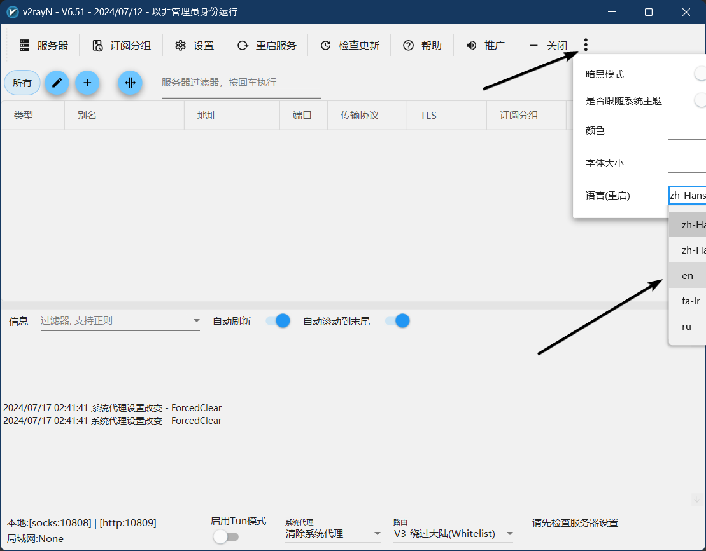
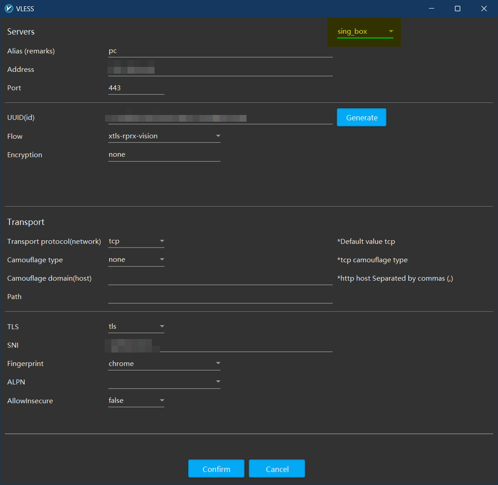
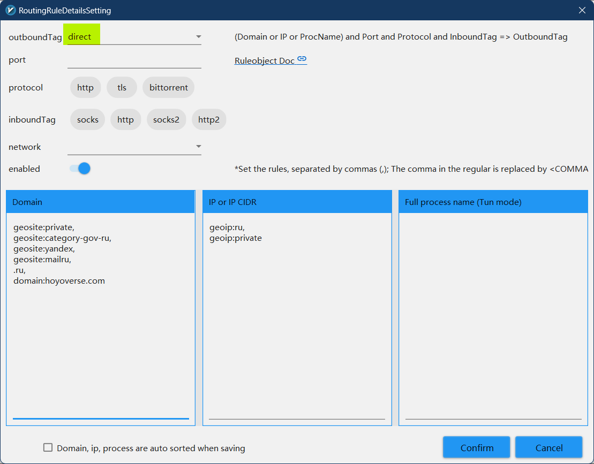
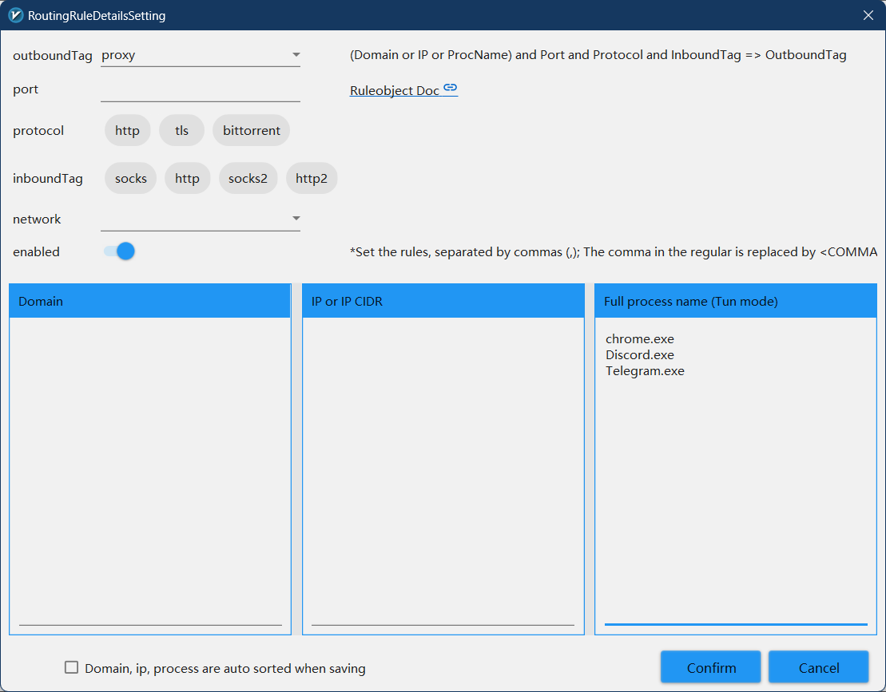
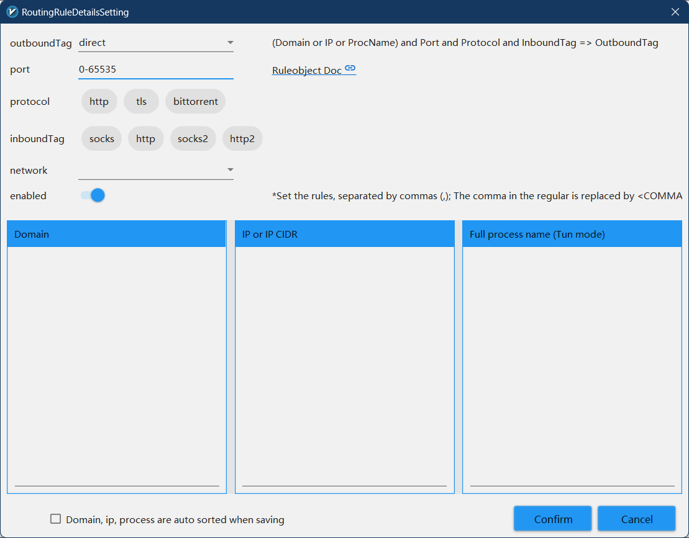
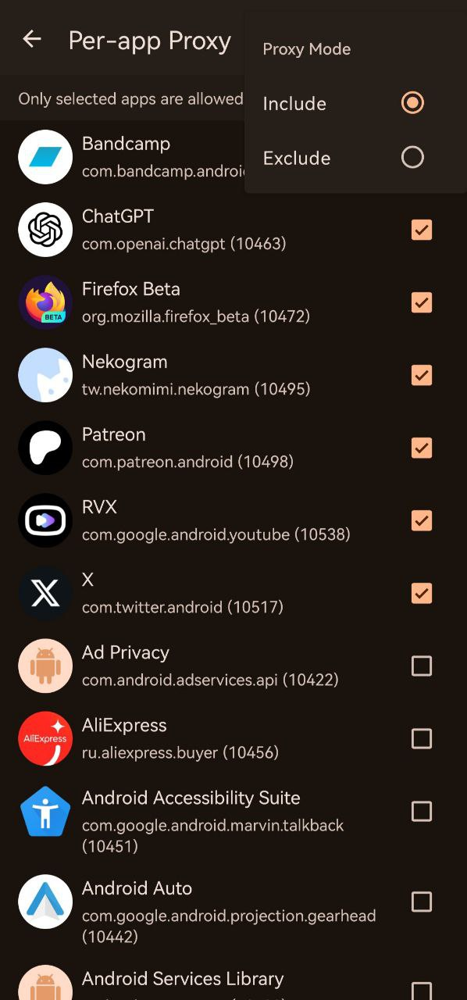

<h1>Пример использования клиента на основе ядра sing-box для обхода цензуры в РФ</h1>

- tl;dr - [ссылка](#бонус) (для тех, кто готов читать вики sing-box и разбираться в конфигурации ядра самостоятельно)

- Гайд для Android - [ссылка](#гайд-для-android)

v2rayN - клиент прокси для Windows, поддерживающий такие ядра, как Xray, v2fly, sing-box и [другие](https://github.com/2dust/v2rayN/wiki/List-of-supported-cores).
Данный клиент содержит множество продвинутых фич для управления проксируемым трафиком, регулярно обновляется и имеет модульное исполнение (бинарные файлы ядер используются в чистом виде и обновляются независимо от самого клиента), что выделяет его на фоне других графических клиентов для соответствующих ядер.

===

В данном примере рассмотрим использование этого клиента с удаленным сервером, настроенным для протокола VLESS.

===

<ol>
<li>Скачиваем крайнюю версию клиента <tt>with core</tt> из вкладки <a href="https://github.com/2dust/v2rayN/releases">релизов</a> официального репозитория.</li>
<p>Сразу же в настройках совместимости в свойстах <tt>v2rayN.exe</tt> поставим запуск от имени администратора. Это необходимо для использования туннеля.</p>
<p>По дефолту язык приложения - китайский, сменим его на английский. <sup>не рекомендую использовать русский</sup></p>
<p>Для этого кликнем на кнопку контекстного меню сверху справа и в появившейся всплывашке вместо <tt>zh</tt> выберем <tt>en</tt>.</p>
<details> <summary>Наглядно</summary>  </details>
<p>Закрываем окно приложения, закрываем его в трее, нажав на самую нижнюю кнопку в появившейся над иконкой в трее всплывашке. Запускаем заново - язык должен смениться на английский.</p>

<li>Во вкладке <tt>Settings - Option Setting</tt> <sup>оцените качество английского и представьте, что там будет на русском</sup> можете изменить приглянувшиеся вам настройки.</li> 
<p>Если не знаете - не трогайте (c). Обязательно ставим <tt>Check for pre-release updates</tt>. Проект sing-box очень активно развивается, поэтому нам нужны все последние багфиксы. Там же можно отключить <tt>Ignore Geo files when updating core</tt>. Если нужно - поставим <tt>Start on boot</tt> во вкладке <tt>v2rayN settings</tt>. Пока не забыли - обновим ядро (<tt>Check Update - Sing-box Core</tt> на главном экране клиента).</p>

<li>Добавляем наш сервер VLESS, нажав на соответствующую кнопку слева сверху.</li>
<p>Если у вас есть URI по типу "vless://here-goes-server-info" - <tt>Import bulk URL from clipboard</tt>, либо выбираем <tt>Add [VLESS] server</tt> и заполняем все ручками. Справа сверху в окошке с параметрами сервера выбираем <tt>sing-box</tt>.</p>
<details> <summary>Наглядно</summary>  </details>

<li>Переходим в <tt>Settings - Routing Setting</tt>.</li>

<ul>
<li>Правая кнопка - <tt>Add</tt>.</li>

<li><tt>Remarks</tt> - название листа, не имеет значения.</li>

<li><tt>sing-box domain strategy</tt> - ipv4_only, если ваш провайдер предоставляет только ipv4.</li>
<p>В пустой области снизу добавляем правила по вашему усмотрению. В <a href="https://sing-box.sagernet.org/configuration/route/rule/">официальной документации</a> sing-box описаны все доступные поля, что они означают и чем их заполнять.</p>
<p>Мое предпочтение такое:
в <tt>direct</tt> (в обход прокси) отправляем все что связано с РФ. Для этого в <tt>Domain</tt> мы вписываем все rule-set <sup>замена geosite.db и geoip.db от sing-box</sup>, связанные с РФ, домен верхнего уровня .ru и какие-либо другие домены, доступ к которым мы хотим получать напрямую.
В колонку <tt>IP or IP CIDR</tt> попадают geoip:ru, geoip:private.</p>

```json
[
  {
    "port": "",
    "outboundTag": "direct",
    "ip": [
      "geoip:ru",
      "geoip:private"
    ],
    "domain": [
      "geosite:private",
      "geosite:category-gov-ru",
      "geosite:yandex",
      "geosite:mailru",
      "domain:.ru",
      "domain:.xn--p1ai",
      "domain:.su",
      "domain:www.right.com.cn",
      "domain:hoyoverse.com"
    ]
  }
]
```

<details> <summary>Наглядно</summary>  </details>

<li>Сохраняем правило кнопкой <b>Confirm</b> и создаем еще одно.</li>
<p>В этот раз outboundTag у нас <tt>proxy</tt>, а в колонку <tt>Full process name</tt> мы запишем названия исполняемых файлов программ, трафик которых мы хотим проксировать. У меня это chrome.exe, Discord.exe, Telegram.exe.</p>
<p><b>Внимание! Case-sensitive!</b>
<sup>поле чувствительно к регистру, discord.exe оно уже не найдет</sup></p>

<details> <summary>Наглядно</summary>  </details>
<li>Вишенкой на торте (третьим правилом)</li> будет являться пуск в direct всего остального трафика, т.е. порты <tt>0-65535</tt>. Добавляем это значение в строку <tt>port</tt> под outboundTag (который <tt>direct</tt>).

```json
[
  {
    "port": "0-65535",
    "outboundTag": "direct",
    "ip": [],
    "domain": []
  }
]
```

<details> <summary>Наглядно</summary>  </details>
</ul>

<p><b>Описанный выше порядок правил важен, логика работает так:</b></p>
<p>1. наш запрос принадлежит описанным rule-set? идем в direct : идем дальше<br />
2. наш запрос от одного из заданных процессов? идем в proxy : идем дальше<br />
3. наш запрос принадлежит портам 0:65535? идем в direct</p>
<p><sup>0:65535 - фактически весь трафик</sup></p>

<li>Наконец, <tt>Settings - DNS Settings</tt></li>
<p>Переходим во вкладку <tt>sing-box</tt>. В правое поле (<tt>TunMode settings</tt>) пишем блок json, ответственный за dns. В данном случае все запросы для российских доменов отправляются Яндекс DNS, а остальные - Cloudflare <sup>в теории яндекс можно заменить на локальный адрес вашего роутера, чтобы запросы отправлялись провайдерскому кэширующему серверу</sup>. Приятный бонус - рекламные домены резолвиться не будут.</p>


```json
{
  "servers": [
    {
      "tag": "remote",
      "address": "https://1.1.1.1/dns-query",
      "strategy": "ipv4_only",
      "detour": "proxy"
    },
    {
      "tag": "local",
      "address": "https://77.88.8.8/dns-query",
      "strategy": "ipv4_only",
      "detour": "direct"
    },
    {
      "tag": "block",
      "address": "rcode://success"
    }
  ],
  "rules": [
    {
      "domain_suffix": [
        ".ru"
      ],
      "rule_set": [
        "geosite-category-gov-ru",
        "geosite-yandex",
        "geosite-mailru"
      ],
      "server": "local"
    },
    {
      "rule_set": [
        "geosite-category-ads-all"
      ],
      "server": "block"
    }
  ],
  "final": "remote"
}
```

<p>Подтверждаем изменения и на главном экране клиента в самом низу переключаем <tt>Enable Tun</tt>. <tt>System proxy</tt> можно оставить на Clear.</p>
<p>Остается только следить за консолью и надеяться, что никаких error там не вылезет. Проверить работу маршрутизации можно, например, при помощи https://yandex.com/internet (должен отобразить ваш домашний ip) и https://fast.com (должен начать тестирование).</p>

</ol>

# Бонус
<ol>
<li>После всех этих манипуляций мы получили готовый конфиг в <tt>guiConfigs/config.json</tt> (в директории v2rayN).</li>
Запустить чистый sing-box на Windows муторно за счет того, что это cmd приложение. Однако существует крайне минималистичный клиент <a href="https://github.com/nextincn/qsing-box">qsing-box</a>, который представляет собой очень небольшую надстройку над бинарным файлом ядра.
<li>Скачиваем клиент,</li>
скачиваем <a href="https://raw.githubusercontent.com/astolfogit/proxy-client-ru/main/assets/check-updates.bat">updater script</a> и кидаем в папку с исполняемым файлом (встроенного апдейтера ядра у клиента нет, поэтому я написал свой, он использует curl, jq и 7zip, если скрипт выдаст соответствующую ошибку - их можно установить через winget по гайду в интернете). Если нужен автостарт клиента, создаем в taskschd.msc задачу с максимальными привилегиями на запуск этого batch скрипта при входе юзера в систему.
<li>В настройках qsing-box выставляем <tt>Run as administrator</tt>.</li>
<li>При помощи соответствующей кнопочки импортируем конфиг <tt>guiConfigs/config.json</tt> из v2rayN.</li>
Файл конфига будет находиться в папке qsing-box/config/.
<li>Удаляем из него все ненужное (куча exe других ядер, настройки маршрутизации для Clash, остатки китайского dns и т.п.), пример чистого конфига указан ниже в гайде для Android.</li>
Для этого рекомендую воспользоваться документацией sing-box, ссылка на которую дана в самом конце этого текста.
</ol>
<p>Таким образом вместо v2rayN мы можем использовать узконаправленный клиент специально для sing-box, что исключает возможные краши/баги и другие недоработки на стороне гораздо более массивного v2rayN.</p>

# Гайд для Android

<ol>
<li>Для Android существует официальный клиент - <a href="https://github.com/SagerNet/sing-box/releases">ссылка</a></li>
<p>Выбираем последний релиз, листаем вниз и скачиваем apk под вашу архитектуру</p>
<li>Читаем все вышеописанное для понимания того, как конфигурируется sing-box</li>
<li>Скачиваем шаблон конфиг-файла - <a href="https://raw.githubusercontent.com/astolfogit/proxy-client-ru/main/assets/android-conf.json">ссылка</a></li>
<li>Редактируем наш json файл, читая оставленные мной комментарии</li>
<p>Отредактируйте блок outbounds в соответствии с вашей конфигурацией сервера. Если до этого настраивали v2rayN, то блок outbounds можно взять оттуда, просто вставьте UUID другого клиента.</p>
<li>Импортируем получившийся файл в sing-box</li>
<li>Переходим во вкладку <tt>Settings - Profile Override</tt></li>
<p>Включаем <tt>Per-app Proxy</tt>, переходим в конфигурацию, вызываем всплывашку, <tt>Proxy Mode - Include</tt></p>
<p>Выбираем все приложения, которые хотим пускать через прокси</p>
<details> <summary>Наглядно</summary>  </details>

<p>Tip: если вы используете Adguard в режиме туннеля, запустить его вместе с sing-box можно, заменив в конфиге inbound <tt>tun</tt> на inbound <tt>http</tt>. <tt>Per-app Proxy</tt> в этом случае стоит выключить - настраивать проксируемые приложения вы будете через Adguard.</p>

```
    {
      "type": "http",
      "tag": "http",
      "listen": "127.0.0.1",
      "listen_port": 10809,
      "domain_strategy": "ipv4_only",
      "sniff": true,
      "sniff_override_destination": true
    }
```

Вставьте один из двух вариантов вместо tun в свой конфиг

</ol>

Credits and resources:
- проект <a href="https://github.com/2dust/v2rayN">v2rayN</a>
- <a href="https://sing-box.sagernet.org/configuration">вики</a> проекта sing-box
- <a href="https://github.com/SagerNet/sing-geoip/tree/rule-set">geoip</a> и <a href="https://github.com/SagerNet/sing-geosite/tree/rule-set">geosite</a> rule-set от разработчика sing-box
- [@L4zzur](https://github.com/L4zzur) (тестирование гайда)
