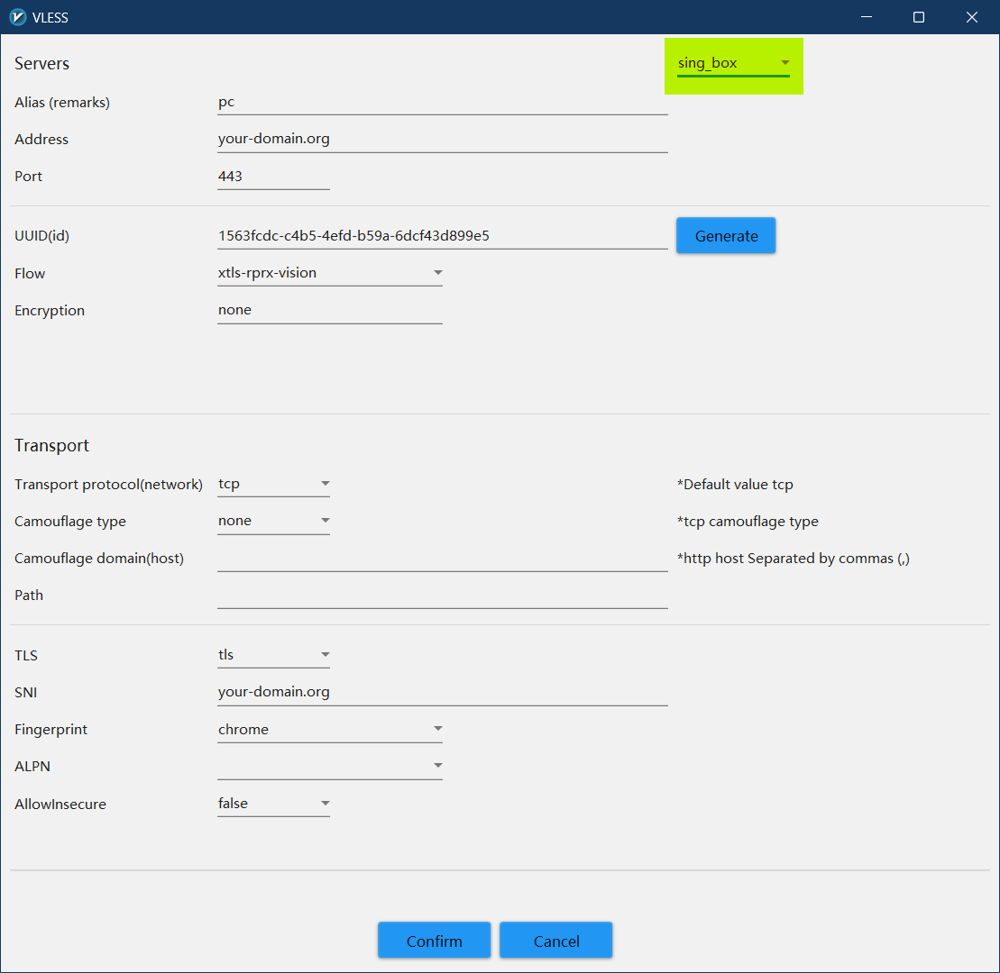

<h1>Пример использования клиента v2rayN для обхода цензуры в РФ</h1>

v2rayN - клиент прокси для Windows, поддерживающий такие ядра, как Xray, v2fly, sing-box и [другие](https://github.com/2dust/v2rayN/wiki/List-of-supported-cores).
Данный клиент содержит множество продвинутых фич для управления проксируемым трафиком, регулярно обновляется и имеет модульное исполнение (бинарные файлы ядер используются в чистом виде и обновляются независимо от самого клиента), что выделяет его на фоне других графических клиентов для соответствующих ядер.

===

В данном примере рассмотрим использование этого клиента с удаленным сервером, настроенным для протокола VLESS.

Использовать будем ядро sing-box и режим туннеля вместо системного прокси.

===

<ol>
<li>Скачиваем крайнюю версию клиента из вкладки <a href="https://github.com/2dust/v2rayN/releases">релизов</a> официального репозитория.</li>
<p>Сразу же в настройках совместимости в свойстах <tt>v2rayN.exe</tt> поставим запуск от имени администратора. Это необходимо для использования туннеля.</p>
<p>По дефолту язык приложения - китайский, сменим его на английский. <sup>не рекомендую использовать русский</sup></p>
<p>Для этого кликнем на кнопку контекстного меню сверху справа и в появившейся вспылвашке вместо <tt>zh</tt> выберем <tt>en</tt>.</p>
<details> <summary>Наглядно</summary>  </details>
<p>Закрываем окно приложения, закрываем его в трее, нажав на самую нижнюю кнопку в появившейся над иконкой в трее всплывашке. Запускаем заново - язык должен смениться на английский.</p>

<li>Во вкладке <tt>Settings - Option Setting</tt> можете изменить приглянувшиеся вам настройки.</li> 
<p>Если не знаете - не трогайте (c). Если нужно - поставим <tt>Start on boot</tt> во вкладке <tt>v2rayN settings</tt>. Там же можно отключить <tt>Ignore Geo files when updating core</tt>. Пока не забыли - обновим ядро (<tt>Check Update - Sing-box Core</tt> на главном экране клиента).</p>

<li>Добавляем наш сервер VLESS, нажав на соответствующую кнопку слева сверху.</li>
<p>Если у вас есть URI по типу "vless://here-goes-server-info" - <tt>Import bulk URL from clipboard</tt>, либо выбираем <tt>Add [VLESS] server</tt> и заполняем все ручками. Справа сверху в окошке с параметрами сервера выбираем <tt>sing-box</tt>.</p>
<details> <summary>Наглядно</summary>  </details>

<li>Переходим в <tt>Settings - Routing Setting</tt>.</li>

<ul>
<li>Правая кнопка - <tt>Add</tt>.</li>

<li><tt>Remarks</tt> - название листа, не имеет значения.</li>

<li><tt>sing-box domain strategy</tt> - ipv4_only, если ваш провайдер предоставляет только ipv4.</li>
<p>В пустой области снизу добавляем правила по вашему усмотрению. В <a href="https://sing-box.sagernet.org/configuration/route/rule/">официальной документации</a> sing-box описаны все доступные поля, что они означают и чем их заполнять.</p>
<p>Мое предпочтение такое:
в <tt>direct</tt> (в обход прокси) отправляем все что связано с РФ. Для этого в <tt>Domain</tt> мы вписываем все rule-set <sup>замена geosite.db и geoip.db от sing-box</sup>, связанные с РФ, домен верхнего уровня .ru и какие-либо другие домены, доступ к которым мы хотим получать напрямую.
В колонку <tt>IP or IP CIDR</tt> попадают geoip:ru, geoip:private.</p>
<details> <summary>Наглядно</summary>  </details>

<li>Сохраняем правило кнопкой <b>Confirm</b> и создаем еще одно.</li>
<p>В этот раз outboundTag у нас <tt>proxy</tt>, а в колонку <tt>Full process name</tt> мы запишем названия исполняемых файлов программ, трафик которых мы хотим проксировать. У меня это chrome.exe, Discord.exe, Telegram.exe.</p>
<p><b>Внимание! Case-sensitive!</b>
<sup>поле чувствительно к регистру, discord.exe оно уже не найдет</sup></p>
<details> <summary>Наглядно</summary>  </details>
<li>Вишенкой на торте (третьим правилом)</li> будет являться пуск в direct всего остального трафика, т.е. порты <tt>0-65535</tt>. Добавляем это значение в строку <tt>port</tt> под outboundTag (который <tt>direct</tt>).
<p>Таким образом у нас будет проксироваться только трафик нужных нам приложений, причем трафик до российских хостов (и любых других выбранных направлений) пойдет напрямую.</p>
<details> <summary>Наглядно</summary>  </details>
</ul>

<li>Наконец, <tt>Settings - DNS Settings</tt></li>
<p>Переходим во вкладку <tt>sing-box</tt>. В правое поле (TunMode settings) пишем блок json, ответственный за dns. В данном случае все запросы для РФ доменов отправляются провайдерскому dns, а остальные - DoH резолверу Cloudflare. Приятный бонус - рекламные домены резолвиться не будут.</p>


```json
{
  "servers": [
    {
      "tag": "remote",
      "address": "https://1.1.1.1/dns-query",
      "strategy": "ipv4_only",
      "detour": "proxy"
    },
    {
      "tag": "local",
      "address": "192.168.1.1",
      "strategy": "ipv4_only",
      "detour": "direct"
    },
    {
      "tag": "block",
      "address": "rcode://success"
    }
  ],
  "rules": [
    {
      "domain_suffix": [
        ".ru"
      ],
      "rule_set": [
        "geosite-category-gov-ru",
        "geosite-yandex",
        "geosite-mailru"
      ],
      "server": "local"
    },
    {
      "rule_set": [
        "geosite-category-ads-all"
      ],
      "server": "block"
    }
  ],
  "final": "remote"
}
```

<p>Подтверждаем изменения и на главном экране клиента в самом низу переключаем <tt>Enable Tun</tt>. Остается только следить за консолью и надеяться, что никаких error там не вылезет. Проверить работу маршрутизации можно, например, при помощи https://yandex.com/internet (должен отобразить ваш локальный ip) и https://fast.com (должен начать тестирование).</p>

</ol>
<br />

Credits and resources:
- проект <a href="https://github.com/2dust/v2rayN">v2rayN</a>
- проект <a href="https://sing-box.sagernet.org/configuration">sing-box</a>
- репозиторий <a href="https://github.com/SagerNet/sing-geosite/tree/rule-set">rule-set</a> от разработчика sing-box
